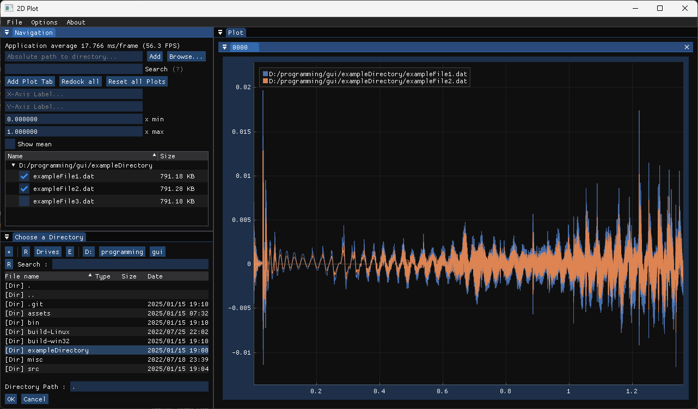

# DearIMGui 2D Curve Plotter

This repository contains a simple application that uses **Dear ImGui** (docking branch) to visualize 2D curves read from ASCII files. The app reads data from files and plots the curves interactively with a graphical user interface (GUI) powered by ImGui and **Implot**. It also uses **ImGuiFileDialog** for opening file dialogs.

## Features
- Read 2D curve data from ASCII files.
- Plot and visualize the curves in an interactive window.
- Built using **Dear ImGui** for the GUI and **Implot** for plotting.
- File dialog support powered by **ImGuiFileDialog**.
- Cross-platform (with focus on Windows, but can be adapted for other platforms).

## Screenshot 
#### Examples from /exampleDirectory showing some signal processing curves:


### Dependencies
- **Dear ImGui**: This project uses Dear ImGui (docking branch) for rendering and handling the GUI.
- **Implot**: A plotting library that integrates with Dear ImGui for rendering 2D plots.
- **ImGuiFileDialog**: A library for creating file dialogs in Dear ImGui.
- **C++ Compiler**: The project requires a C++ compiler that supports C++11 or higher.
- **GLFW**: For windowing and OpenGL context management.
- **OpenGL**: For rendering the 2D plots.

### Windows-specific
For Windows, a `build.bat` file is provided to simplify the build process.

## Building the Project

### 1. Clone the Repository
Start by cloning the repository to your local machine:
```bash
git clone https://github.com/tamirre/curve2dplot.git
cd curve2dplot
```

### 2. Build on Windows

On Windows, you can build the project using the provided `build.bat` script.

1. Ensure you have a C++ compiler (e.g., MSVC or MinGW) installed.
2. Run `build.bat` in the project directory:
   ```batch
   build.bat
   ```
   This will:
   - Compile the application.
   - Produce an executable that you can run.

## Running the Application

Once the application is built, you can run the generated executable. The program will launch a window that allows you to:

- Open an ASCII file containing 2D curve data (with `x y` values per line).
- Visualize the curves with interactive zooming and panning support.
- Edit the style of the plot, lines, font, axis labels and more.

Example data format in the ASCII file:
```
# Lines with a hashtag in fron are treated as comments and are ignored
0 1
1 3
2 7
3 15
4 31
```

## License

This project is licensed under the MIT License - see the [LICENSE](LICENSE.md) file for details.

## Acknowledgements

- **Dear ImGui**: https://github.com/ocornut/imgui
- **Implot**: https://github.com/epezent/implot
- **ImGuiFileDialog**: https://github.com/aiekick/ImGuiFileDialog
- **GLFW**: https://www.glfw.org/
- **OpenGL**: https://www.opengl.org/
